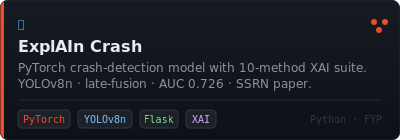
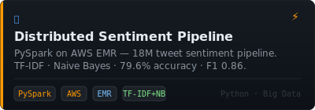

<h1>Zaeem ul Islam</h1>
<h3>Software Engineer &mdash; AI &amp; ML Systems</h3>

[;%3E%3E%3E+model.skills+%3D+%5BRAG%2C+PyTorch%2C+FastAPI%2C+...%5D;%3E%3E%3E+model.ship(solo_projects%3D2%2C+env%3D%22prod%22);%3E%3E%3E+open_to(%22remote+SWE+%2F+ML+roles%22))](https://git.io/typing-svg)

---

I ship production AI systems — **multi-tenant RAG platforms**, **multi-agent pipelines**, and **PyTorch computer vision models**.
Two client systems solo-built from architecture to deployment, both live today.
Recent BS in Data Science, FAST-NUCES Lahore (2026) · Paper published to **SSRN**.

`📍 Lahore, Pakistan` &nbsp;·&nbsp; `Open to remote & on-site roles`

---

## ▸ What I Build

<table>
<tr>
<td width="50%">

**LLM / RAG Systems**
Multi-tenant chatbot SaaS, per-tenant vector-store isolation, multi-agent content pipelines

</td>
<td width="50%">

**Computer Vision + XAI**
PyTorch late-fusion architectures, 10-method explainability suites, dash-cam crash detection

</td>
</tr>
<tr>
<td width="50%">

**Production Backends**
FastAPI / Flask at scale, multi-service Nginx deployments, Docker on AWS

</td>
<td width="50%">

**Data Pipelines**
PySpark on AWS EMR at 18M+ record scale, ML analytics, automated ingestion

</td>
</tr>
</table>

---

## ▸ Tech Stack

**Languages**

`Python` &nbsp;·&nbsp; `TypeScript` &nbsp;·&nbsp; `JavaScript`

**ML / AI**

`RAG` &nbsp;·&nbsp; `LangChain` &nbsp;·&nbsp; `Multi-Agent` &nbsp;·&nbsp; `OpenAI API` &nbsp;·&nbsp; `Gemini API` &nbsp;·&nbsp; `ChromaDB` &nbsp;·&nbsp; `FAISS` &nbsp;·&nbsp; `Pinecone` &nbsp;·&nbsp; `Sentence-Transformers`

**Backend / Frontend**

`FastAPI` &nbsp;·&nbsp; `Flask` &nbsp;·&nbsp; `React` &nbsp;·&nbsp; `Next.js` &nbsp;·&nbsp; `PostgreSQL`

**Cloud & DevOps**

`AWS` &nbsp;·&nbsp; `Docker` &nbsp;·&nbsp; `Nginx` &nbsp;·&nbsp; `Linux` &nbsp;·&nbsp; `Git`

---

## ▸ Featured Work

&nbsp;

 

**Client Work @ Wesolvd** *(code available on request)*

| Project | What it is | Stack |
|---|---|---|
| **LeadsRep ChatBot** | Multi-tenant RAG SaaS live at [leadsrep.co](https://leadsrep.co) — hand-rolled RAG pipeline, per-tenant ChromaDB isolation, embeddable widget, 90-route FastAPI backend | FastAPI · ChromaDB · Next.js · Docker |
| **KataLog (Inventory Planner)** | Multi-store Shopify inventory platform — replenishment forecasting, cross-store mirroring microservice · [warehousekatalog.com](https://warehousekatalog.com) | FastAPI · React 19 · Shopify API |
| **AI Content Refinement** | Multi-agent pipeline (Engineer / Creator / Evaluator) with RAG over Pinecone, orchestrated via n8n | LangChain · Pinecone · n8n |

---

## ▸ Contribution Activity

<picture>
  <source media="(prefers-color-scheme: dark)" srcset="https://raw.githubusercontent.com/zaeem-chaudry/zaeem-chaudry/output/github-snake-dark.svg" />
  <source media="(prefers-color-scheme: light)" srcset="https://raw.githubusercontent.com/zaeem-chaudry/zaeem-chaudry/output/github-snake.svg" />
  
</picture>

---

## ▸ GitHub Stats

&nbsp;

---

## ▸ Connect

&nbsp;

  
<code>───────────────── [ EOF ] ─────────────────</code>

